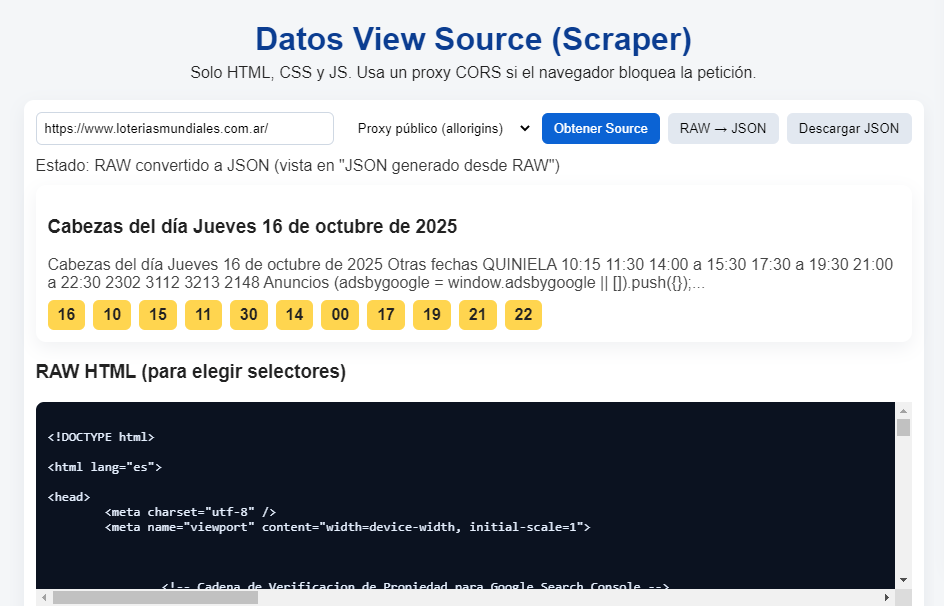
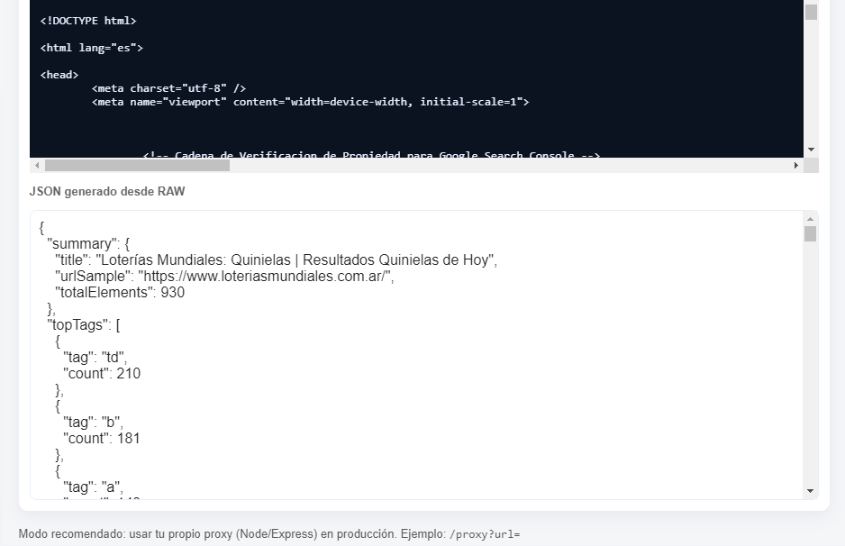

# Datos View Source (Scraper)

> Visualizador / scraper simple en HTML/JS para obtener el *source* de una página, explorar el HTML y generar un JSON auxiliar para ayudar a construir selectores.

Este repositorio contiene una única página HTML que permite:
- Obtener el HTML de una URL (directo o usando proxy público / personalizado).
- Visualizar el RAW HTML.
- Intentar extraer secciones “Cabezas” y detectar números.
- Convertir el HTML cargado en un JSON auxiliar con ids, clases, headers y un conteo de tags.
- Descargar el JSON generado.

---

## 🚀 Características principales

- Solo HTML, CSS y JavaScript (sin dependencias externas).
- Modos de fetch:
  - **Proxy público (allorigins)** — usa `https://api.allorigins.win/raw?url=`.
  - **Fetch directo** — puede fallar por CORS.
  - **Proxy personalizado** — usa tu propio endpoint.
- Botones:
  - **Obtener Source** — trae el HTML.
  - **RAW → JSON** — genera un JSON auxiliar.
  - **Descargar JSON** — guarda el resultado.

Incluye heurísticas para detectar secciones llamadas “Cabezas” y extraer números de 3-4 dígitos.

---

## 💡 Uso rápido

1. Clona o descarga el repositorio.
2. Abre el `index.html` en tu navegador.
3. Escribe la URL objetivo y haz clic en **Obtener Source**.
   - Si hay error por CORS, usa el modo `Proxy público (allorigins)` o configura tu proxy.
4. Pulsa **RAW → JSON** para generar el JSON auxiliar.
5. Descarga el resultado con **Descargar JSON**.

> ⚠️ El modo directo puede fallar si el sitio bloquea peticiones externas (CORS).

---

## 🧩 Ejemplo de interfaz

## No olvides darle ⭐ a este repositorio si te gustó.
